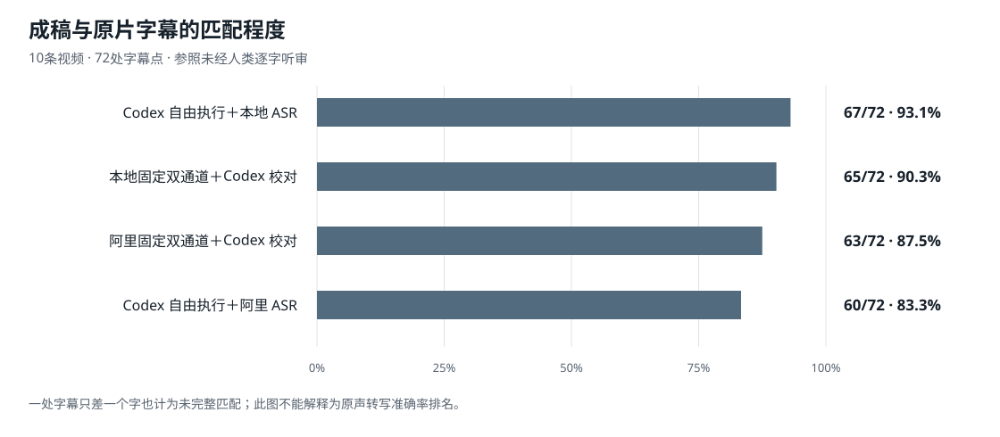

# 视频转脚本准确性评测与改进建议

评测日期：2026-09-26。范围：本地视频到原片角色台词，以及后续准确性改进方案。

## 结论与决策

本轮没有证据表明，仅将本地 ASR 换成阿里 Paraformer-v1，就能提高 Codex 最终成稿的准确性。更明确的问题发生在字幕覆盖、两路合并和改写约束：自动合并甚至会把语音已识别正确的金额覆盖成错误值。

- 在同一批 10 条视频的 72 处可见对白字幕上，Codex 自由执行＋本地 ASR 完整匹配 **67/72（93.1%）**；自由执行＋阿里 ASR 匹配 **60/72（83.3%）**。
- 两组对应的抽检字符一致率为 **99.2% 与 98.0%**，字符编辑差异分别是 **5 与 12**；25 处数值抽检均明确匹配。一个字幕点只差一个字，也会计为整点不匹配，因此不能只看两个百分比的表面落差。
- 参照来自原片可见字幕，没有人类逐字音轨真值。字幕可能省略语气、儿化和重复，**这些成绩不能表述为全片语音识别准确率，也不足以证明本地模型总体强于闭源模型**。
- 目前可保留原自由执行流程作为工作基线，优先修复规则冲突和错误覆盖，再用原声听审与新样本检验改动。

以上为本轮观察与建议。下文的改进项目尚未实施，也没有修复后效果数据。

图中横轴从 0 开始；展示的是字幕点完整匹配率。逐组精确分子、字符差异和数值检查见 [汇总数据](data/metrics.json)。

## 1. 要回答的问题

目标是从参考视频还原完整台词与角色，尽量保留原话、顺序、重复和反应；如需品牌适配，只修改已明确允许的套餐、价格和门店字段。

本轮检验不同识别与整理策略能否更稳定地完成原片还原。没有检验抖音下载成功率，也没有将套餐改写质量混入原片识别分数。

“自由执行”指 Codex 可以自行决定抽帧密度、OCR 范围、冲突核对和疑难片段复识别方式。它实际调用了 ASR 与字幕工具，并非只读一个提示词就凭空生成脚本。

## 2. 样本与比较方法

素材库包含 20 条真实视频与 30 条改编模板。以固定种子 20260926，从真实视频中抽取 10 条，排除此前已反复调试的 C03、C12、C13、C15。每条输入均核对文件哈希。

每条预选 8 个时间点，共 80 帧；排除重复字幕、纯计数花字、扫码拟声等不适合对白核对的内容后，形成 **72 处参考字幕、613 个归一化字符、25 处数值出现位置**。参照在查看最终成稿前固定。

各执行组使用相同的 Skill 快照，未读取其他组的成稿或参考评分。需要注意：执行组由 Codex 独立运行，**没有人类直接听审**。

### 被测策略

1. **本地固定双通道自动合并**：本地 FunASR Paraformer、分段/标点/说话人组件、原有领域纠错，与 macOS Vision OCR 并行，再按既有规则合并。
2. **阿里原始转写**：真实调用 Paraformer-v1，保留时间戳；该测试配置未启用云端说话人区分。
3. **阿里固定双通道自动合并**：阿里 ASR 与同片本地 OCR 结果复用，沿用原有合并器。
4. **固定双通道后由 Codex 校对**：分别针对本地和阿里输入，由独立 Codex 组检查冲突、原帧与角色。
5. **Codex 自由执行＋本地 ASR**：允许自行选工具。前 6 条使用 Whisper small，后 4 条主要使用 FunASR，其中一条另用 Whisper 复核。
6. **Codex 自由执行＋阿里 ASR**：保留自主抽帧、OCR 和复核自由，只限定 ASR 为 Paraformer-v1。复用刚完成的同源整段 API 结果，另外成功调用阿里复识别 6 个疑难音段。

因此，最后两组比较的是实际工具策略，**不是除模型之外所有步骤都完全固定的单模型实验**。

### 指标定义

- **字幕点完整匹配率**：输出中最佳连续片段与参考字幕在归一化后完全相同的点数 / 72。忽略标点和空格，统一数词写法及“哎/诶/欸”。
- **抽检字符一致率**：1 − 这些匹配片段的字符编辑次数 / 613。它不惩罚抽检位置以外的额外句子，不能替代全片字错误率。
- **数值明确匹配**：对应匹配片段内，完整数值边界明确且与参照一致的出现次数 / 25。连写的价格与件数可能产生歧义，必须结合原文核对，不能把这一项单独称为全部金额事实正确率。
- 角色归属、全文漏句和新增内容仅做定性观察，未建立完整人工真值，未报告虚构的准确率。

## 3. 实测结果

### 未经 Codex 校对的输出

- 本地固定双通道自动合并：**49/72（68.1%）**；抽检字符一致 **92.2%**；数值明确匹配 **21/25**。
- 阿里 Paraformer-v1 原始转写：**45/72（62.5%）**；抽检字符一致 **90.5%**；数值明确匹配 **23/25**。
- 阿里 ASR＋固定 OCR 自动合并：**44/72（61.1%）**；抽检字符一致 **88.9%**；数值明确匹配 **20/25**。

### 经 Codex 整理的成稿

- 本地固定双通道＋Codex 校对：**65/72（90.3%）**；抽检字符一致 **98.9%**；数值明确匹配 **25/25**。
- 阿里固定双通道＋Codex 校对：**63/72（87.5%）**；抽检字符一致 **98.5%**；数值明确匹配 **25/25**。
- Codex 自由执行＋本地 ASR：**67/72（93.1%）**；抽检字符一致 **99.2%**；数值明确匹配 **25/25**。
- Codex 自由执行＋阿里 ASR：**60/72（83.3%）**；抽检字符一致 **98.0%**；数值明确匹配 **25/25**。

自由调用阿里组的 12 处字幕点差异各为一个字符或语气词，例如“你/您”“呢/啦”、儿化和口头重复。保留了真实口头重复的稿子可能更忠实，但相对简写字幕反而扣分。没有人耳听审，不能将这些差异全部归为误听。

完整逐视频计数见 [per-video.json](data/per-video.json)。本报告不把单轮十条的观察推广成模型排行榜。

## 4. 已发现的错误机制

### 4.1 正确金额被自动覆盖

C18 的原片画面与阿里原始 ASR 均为 **573**，自动合并却输出 **57**。这属于可确认的后处理错误：即便语音通道先识别正确，成稿仍可能在合并时损坏。

代码检查发现，现有规则会在部分相似度条件下优先使用带阿拉伯数字的字幕文本，缺少足够的截断检测与完整数值校验。应把“573 对 57”视为需要复核的冲突，而非自动覆盖的理由。

### 4.2 固定字幕区域漏读

C10 的下方持续有对白小字幕，但固定 OCR 取字范围没有覆盖它们，流程将其判为字幕稀疏。Codex 重新查看原帧后能补回。字幕位置、换行和镜头变化需要动态处理。

### 4.3 画面文字被拼入对白

自动稿出现重复开头、重复数字，以及将券卡上的“预估到手价”等文字混入对白的情况。画面文字识别正确，也不意味着它属于人物口播。

代码检查还发现，UI 噪音过滤词包含“抖音”“点击”等普通词。这可能误删“我看抖音团购……”这类真实对白；这一风险来自代码逻辑检查，尚未单独完成修复后的对照试验。

### 4.4 Skill 指令冲突

本轮使用的本地 Skill 快照，同时保留“改写人物、台词”“结尾给行动指引”，以及“只替换指定字段、不要新增宣传句”。这会给执行者相互冲突的目标，需要统一为最小改写规则。

该发现针对本轮冻结的本地快照，不代表对仓库后续版本逐行审计的结论。

## 5. 改进顺序与验收方式

以下均为**建议实施项**，不是已修复声明。

### P0 统一原稿还原与最小改写约束

先确认原片逐句文本，再执行允许字段的替换。删除要求自动补钩子、补行动指引、重写人物台词的冲突条款。内部保留每句的时间范围和来源，用户成稿继续只显示“角色：台词”。

验收：对比原稿与品牌稿，除允许的品牌、套餐、价格和门店字段，以及必要的相邻语法调整外，不应出现无依据新增、删句或改换情节。

### P0 将数值冲突改为复核任务

保留 ASR 与 OCR 两个候选值；检测截断、数值粘连、重复、单位和套餐件数。检查相邻完整字幕帧及对应短音段。无法解决时标记待核，禁止默默用单帧 OCR 覆盖。

验收：以“573→57”“699→699699”等已确认故障建立回归样例，并在未参与调试的新视频中复测，不能只针对这两个数字写替换规则。

### P1 自适应字幕范围并区分文字用途

先看全画面中持续出现的对白字幕位置，再按变化补抽帧；兼顾上下字幕和多行文字。UI、水印、商品卡、花字与对白分开处理。不得单凭“抖音”“点击”等关键词剔除文字，也不得把孤立价格卡自动插入台词。

验收：覆盖底部字幕、字幕移动、换行、多人问答及只有花字的片段，检查对白漏读和非口播文字误插入。

### P1 只对疑难片段调用第二路识别

保留默认识别结果，在金额、品牌、否定词、反应词、说话人交接处发生冲突时，查看原帧并按需重识别短音段。第二路结果用于提供证据，不以模型票数替代原声核实。

验收：记录触发原因、复查结果、未解决项及额外耗时；禁止无证据的整句润色或领域词典强行替换。

### P1 建立以原声为依据的测试集

先听审已有 12 处分歧音段，区分模型错误、字幕简写和角色不确定。再选择未参与调试的完整视频，建立含角色、原话、重复与不清楚标记的人工参考稿。

正式评价应分别计算音轨字错误率、漏句、无依据新增、关键业务字段和角色归属；不要将这些问题折算成一个不透明总分。

### P2 缓存与失败恢复

按源文件哈希缓存整段转写和 OCR，保存云端任务断点；对传输故障采用有上限重试，避免重复提交同一任务。网络失败应单列，不能当成模型识别失败。

本轮已通过恢复任务和重试取得 10 条真实云端输出；这项机制有执行记录。将其整理为生产配置仍属于后续工作。

## 6. 耗时与可比性

原自由执行组的单条记录耗时中位数约 148 秒；阿里识别成功尝试的识别段中位数约 16.3 秒。两者测量阶段不同，不能直接相减或宣称数倍提速。

云端测试存在 SSL 查询中断和上传超时。阿里自由执行补测复用了整段识别缓存，新增片段调用也有额外网络耗时。准备时间、权限重试、缓存、模型加载和并发负载未完全控制，因此本报告不作严格速度排名。

## 7. 适用边界

- 主要样本具有可见字幕，不能推断无字幕、方言、强噪声或多人重叠语音的表现。
- 字幕点匹配与字符一致率共用同一参照，不是两份独立正确性证据。
- 输出最佳片段匹配不能发现全文所有多写或漏写；角色也未完成逐句人工听审。
- 各策略仅一轮运行，独立 Codex 的工具选择和取舍也有差异。
- 既有开发样本被排除，但样本量仍小；后续修复应在新样本上验证。
- 原始视频、完整台词、凭据、本地路径和会话记录没有进入此发布包。公开数据可核对报告算术，但不构成完整复现实验所需的全部素材。

## 8. 数据与核验

- [策略汇总](data/metrics.json)
- [70条匿名策略×视频记录](data/per-video.json)
- [方法与范围](data/methodology.json)
- [报告数据核验脚本](validate_report.py)

在此目录运行 `python3 validate_report.py`，可检查 7 种输出、每组 10 条、72 个字幕点、613 个字符和 25 处数值的汇总一致性。这只验证公开报告的计算，不替代原声听审。

数值校验已修正为匹配片段内的完整数值边界。本地自动合并稿的数值统计从早期较宽松的 24/25 更正为本报告的 21/25；各校对成稿保持 25/25。
